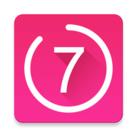

# Android-7-Minutes-Workout
An Application that helps you track your workout routine. Application Using Kotlin Language. Database stored in SQLite

 

<h3 align="center" style="font-weight:bold">7 Minutes Workout</h2>
<h3 align="center">Android App</h3>

## Features
* 12 different exercises.
* 30 seconds per each exercise with 10 seconds rest between each other.
* The name of upcoming and current exercise is spoken aloud using TextToSpeech.
* Tracking history of exercises using Room Database.
* Constains BMI Calculator with Metric and US units.
  
## Screenshots

